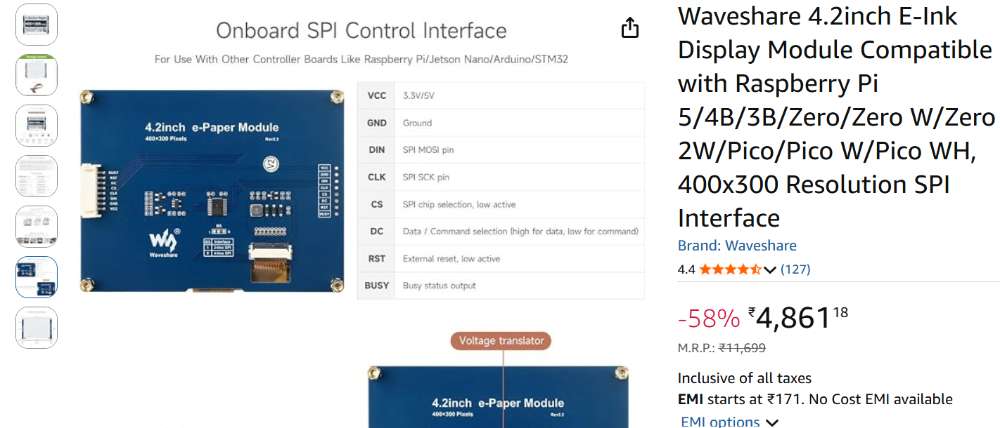
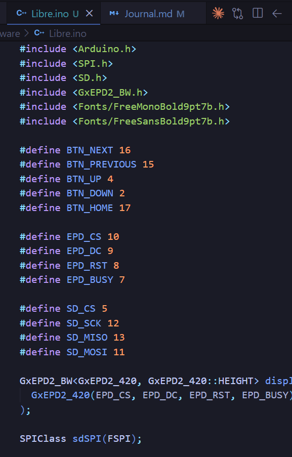

# Libre by DreamXV #
## I will be documenting this project in journal as well as lapse and hacktime##
---
## Day 1 - 14 sept 26 ##
### So from today warm-up wek started and i thought of making a e-ink reader for myself which i can use for reading like PDFs, ePUBs, Webtoons and other reading material. My main inspo is the amazon kindle so I have planned the following features for my reader:
- E-ink display
- Next Page Button
- Previous Page Button
- Up Button
- Down Button 
- And at last Home Button 

* Inspo Look of how it would look like *

## Hardware ## 
### for now i have finalized the hardware list and it is available in Readme.md ### 

## For today i am only journaling as it is much of a brainstorming phase and i am yet to build Schematic PCB or CAD ##

## Time spent this session: 1 hour ##

---

## Day 2 - 15 sept 26 ##
## Session-1 ##
### So In this session I will be working on building schematic for Libre. So i used AI to help me make schematics and find sch and mod files for symbols and footprint. SO it took so much time and effort of mine to check and connect each gpio and pin properly. I also added micro sd card slot and all. Now going for lunch break.### 

## Time spent this session: 1 hour 40 mins  ##

## Day 2 - 15 sept 26 ##
## Session-2 ##
### So In this session I will be working on PCB design for Libre. It was hell lot worse then schematic to find step models and designing PCB according to display was nightmare. But finally I made it!... I just want to thank god to give me strength from making this pcb as i would have left the chat gng :3 .... Here i present you PCB ###

## Time spent this session: 2 Hours ##

## Day 2 - 15 sept 26 ##
## Session-3 ##
### So In this session I will be working on CAD design for Libre. It was the biggest mistake i made ever and because of it i had to make button and slider buttons extras so that it could be outside the frame to use but it turned out good for reading so now i present you CAD Design ### 

## Time spent this session: 1 Hour 56 Minutes ##

## Day 3 - 16 sept 26 ##
## Session-1 ##
### So In this session made final touches of cad design for button and it turned out good so here is the extra part for mounting buttons and slider ### 

## Time spent this session: 12 Minutes ##

## Day 3 - 16 sept 26 ##
## Session-2 ##
### So In this session i wrote the firmware for Libre. So i wrote an os type system for it to select the pdf of the book in and read it . It was hell lot of fun and also challenging to write it as it was my first time writing firmware for an e-reader. But due to my C++ skill i coded it a lot faster. Butt i want to add more featuresas they are left. ### 

## Time spent this session: 43 Minutes ##