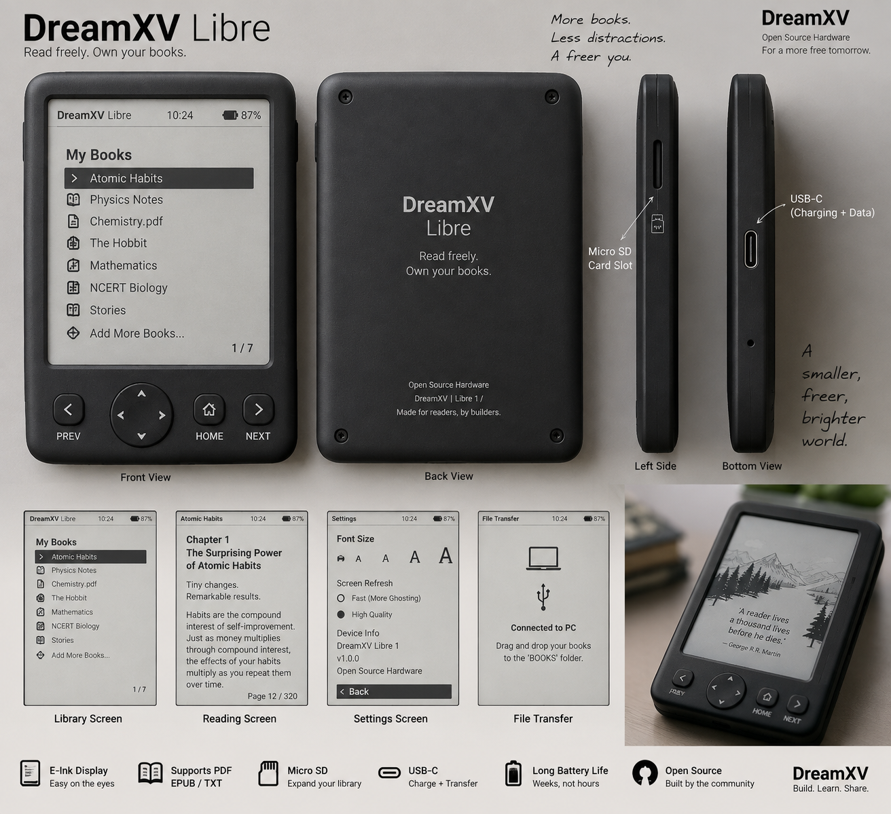
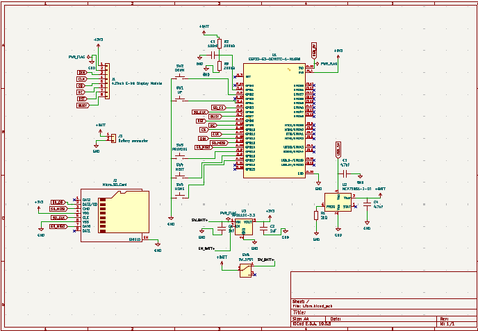
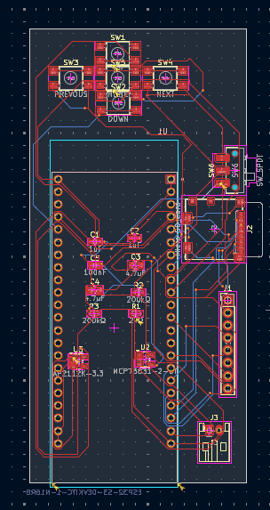
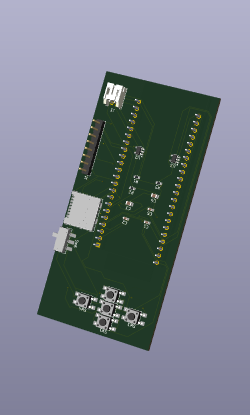
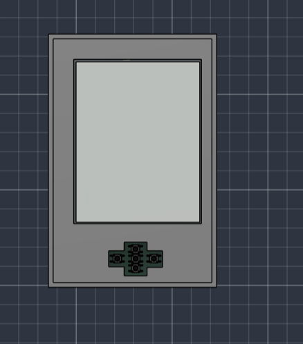

# Libre By DreamXV #
## It is an E-Ink Reading Device made for portability and mostly for warm-up week of *halflife.hackclub.com*. I have always been a fan of Kindle but its price is too high and it is not that customizable so I thought of making my own e-ink reader. ##
---
## Specs ##
- **Processor** ESP32-S3-WROOM-1-N16R8
- **Display** Waveshare 4.2", 400×300, B/W, SPI
- **Battery** 3.7 V Li-Po, 2000 mAh
- **MicroSD card**	16/32 GB 
- **USB-C** USB 2.0 Type-C receptacle
- **5 UI buttons** 6×6 × ~5 mm tactile push button
- **Power switch** SPDT slide switch

## Inspo Look ##

## Approximate BOM : ##

| Part | Specification | Qty |
|---|---|---:|
| E-Ink Display | Waveshare 4.2" 400×300 B/W, SPI | 1 |
| Microcontroller | ESP32-S3-WROOM-1-N16R8 | 1 |
| Storage | 16–32GB MicroSD Card + Socket | 1 |
| Battery | 3.7V 2000mAh Li-Po | 1 |
| Charging | USB-C Li-Po Charging Circuit | 1 |
| Power Switch | SPDT ON/OFF Slide Switch | 1 |
| Navigation | 6×6mm Tactile Buttons | 5 |
| PCB | Custom 2-Layer PCB | 1 |
| Enclosure | Custom 3D-Printed Case | 1 |

## ** Approximate BOM ~ 70 to 90 $ or ~7000 to 8500 INR ** ##

### ** Note: The pricing is approximate and can vary until final schematic and pcb ** ###

## Schematic ##
### So i used AI for planing the connections of schematics and it just made me wanna die so yeah i dont know what to write more ###

## PCB ## 
### I just wanna give up mannnnnnnnnnn! >>>>>>>>>>3 It just got worse and worse for me but here i present you my PCB ###

## CAD ##
### CAD design for Libre. It was the biggest mistake i made ever and because of it i had to make button and slider buttons extras so that it could be outside the frame to use but it turned out good for reading so now i present you CAD Design ###

## Final BOM ##

# DreamXV Libre — Final BOM

| Part | Qty | Unit Price (INR) | Total (INR) | Price Basis | Design Ref |
|---|---:|---:|---:|---|---|
| Waveshare 4.2-inch E-Ink Module B, 400x300 | 1 | ₹4,861.00 | ₹4,861.00 | Amazon India / current listing checked | Main display |
| ESP32-S3-DEVKITC-1-N16R8V | 1 | ₹1,500.00 | ₹1,500.00 | Indian/Amazon market listing checked | Main MCU board |
| Li-Po battery 3.7V 3000mAh | 1 | ₹500.00 | ₹500.00 | Indian hobby-retailer budget | Battery |
| Custom PCB | 1 | ₹1,000.00 | ₹1,000.00 | User budget | PCB fabrication |
| 3D-printed enclosure | 1 | ₹960.00 | ₹960.00 | User budget: $10 | 3D printing |
| Molex 104031-0811 MicroSD socket | 1 | ₹100.00 | ₹100.00 | Indian distributor budget | J2 |
| JST-PH 2-pin battery connector | 1 | ₹40.00 | ₹40.00 | Indian hobby-retailer budget | J3 |
| 8-pin display connector/header | 1 | ₹50.00 | ₹50.00 | Indian hobby-retailer budget | J1 |
| MCP73831-2-OT Li-Po charger IC | 1 | ₹80.00 | ₹80.00 | Indian distributor budget | U2 |
| AP2112K-3.3 LDO | 1 | ₹50.00 | ₹50.00 | Indian distributor budget | U3 |
| TL3305AF160QG SMD tactile button | 5 | ₹48.00 | ₹240.00 | Robu India listing | SW1-SW5 |
| C&K JS102011SAQN SPDT SMD switch | 1 | ₹150.00 | ₹150.00 | Indian distributor budget | SW6 |
| 1uF 0805 MLCC | 2 | ₹10.00 | ₹20.00 | Robu India example | C1-C2 |
| 4.7uF MLCC | 2 | ₹15.00 | ₹30.00 | Indian distributor budget | C3-C4 |
| 100nF 0805 MLCC | 1 | ₹3.00 | ₹3.00 | Indian distributor budget | C5 |
| 2kΩ 0805 resistor | 1 | ₹2.00 | ₹2.00 | Indian distributor budget | R1 |
| 200kΩ 0805 resistor | 2 | ₹0.31 | ₹0.62 | Robu India example | R2-R3 |

## Total Cost

- **Total INR:** ₹9,586.62
- **Exchange Rate:** ₹95.95 = $1
- **Total USD:** $99.91
- **Budget:** $100
- **Status:** UNDER $100

## Firmware ##

### ** The firmware is written for the ESP32-S3 and handles the main functions of Libre like the E-Ink display, MicroSD card, 5 navigation buttons and battery monitoring. It also has a simple file browser for selecting books and basic TXT reading. PDF files can be detected and listed, with proper PDF rendering planned for a future version. ** ###

 